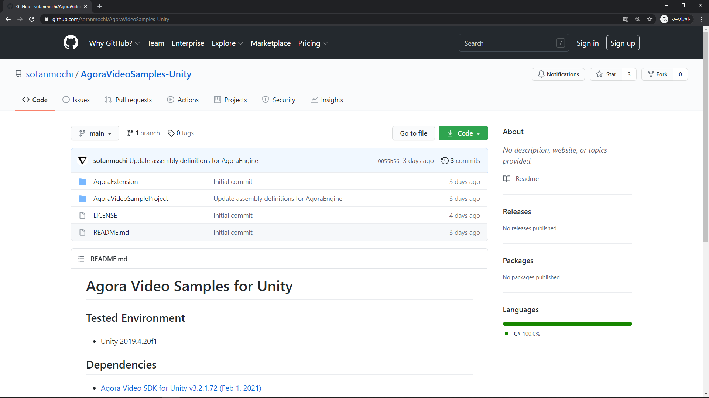
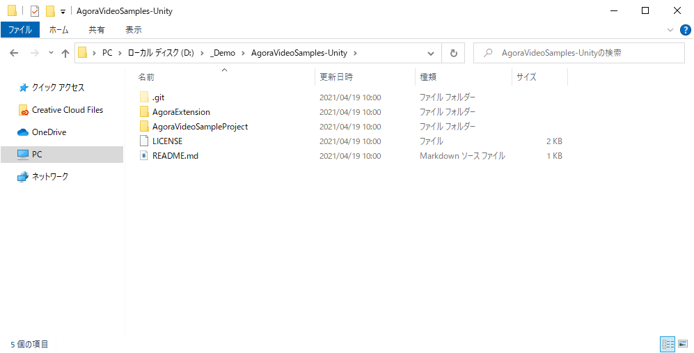
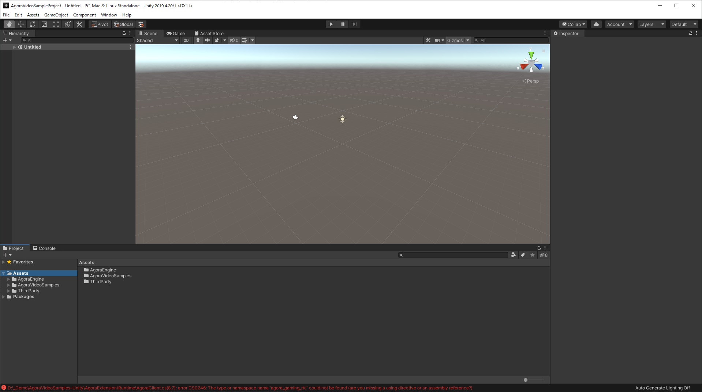
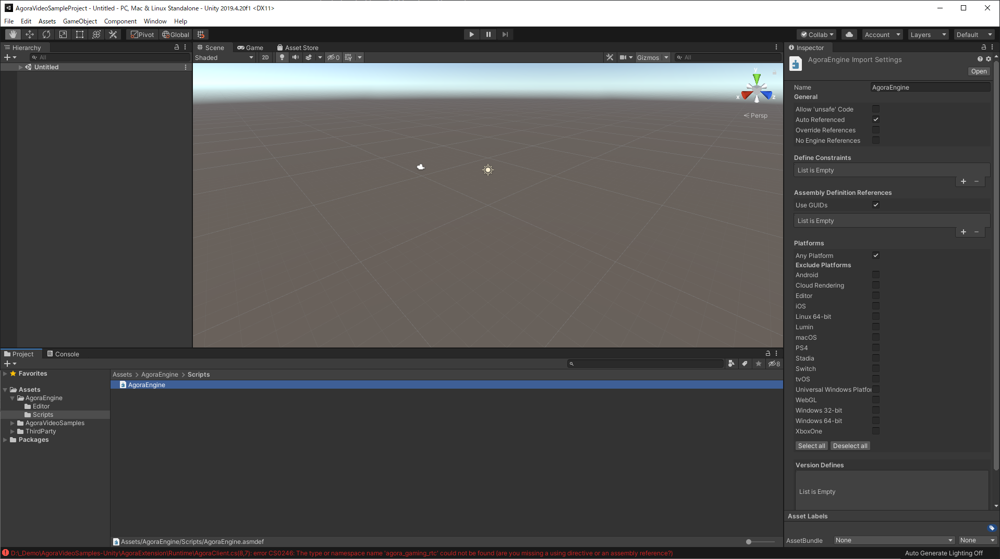
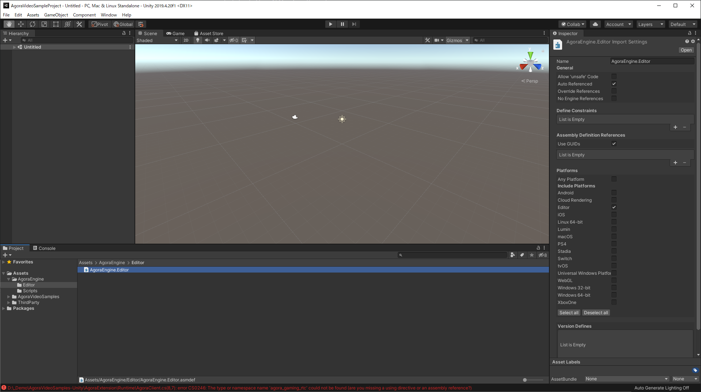
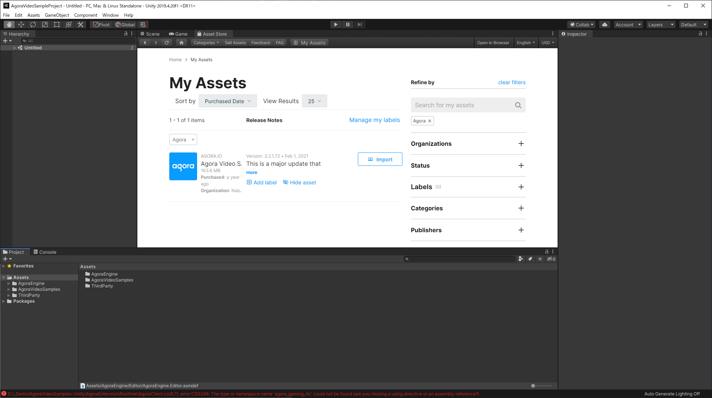
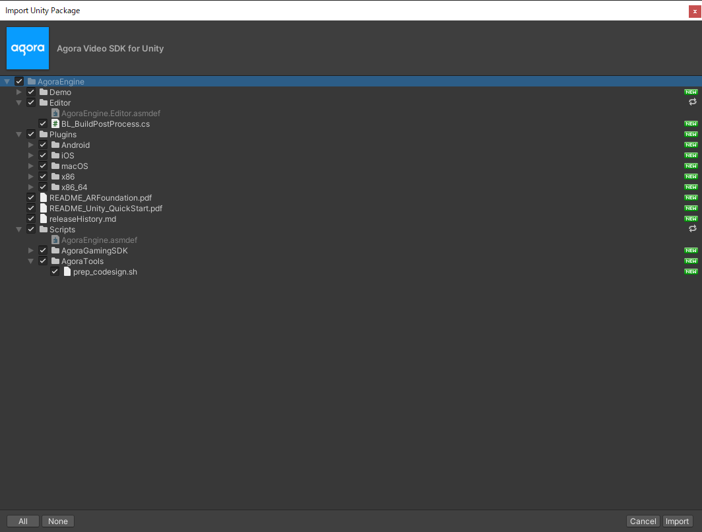
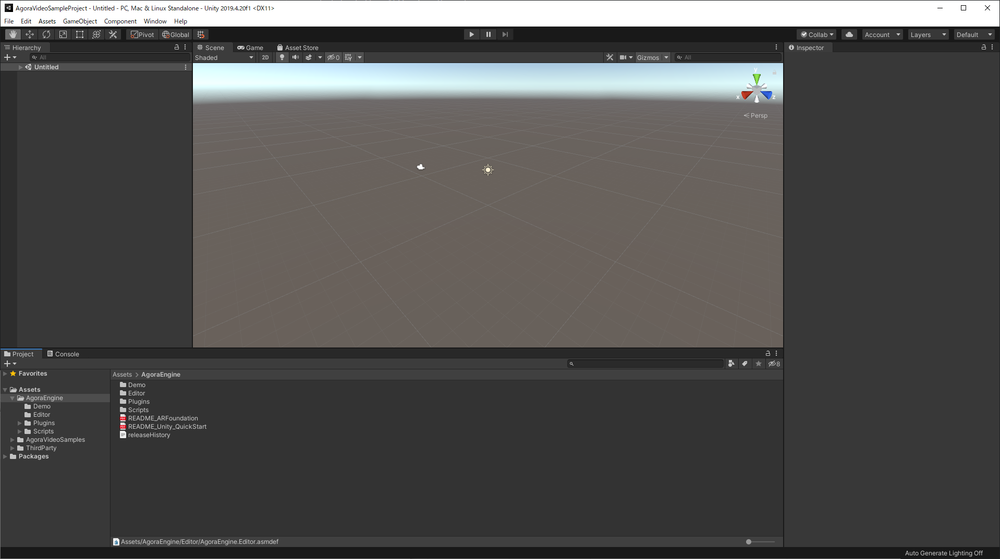

# Project setup

## 1.
プロジェクトをクローンする

## 2.
"AgoraVideoSampleProject"をUnityで開く

## 3.
AgoraEngineのフォルダ内にAssembly Definitionが存在していることを確認する

## 4.
アセットストアから[Agora Video SDK for Unity](https://assetstore.unity.com/packages/tools/video/agora-video-sdk-for-unity-134502)をインポートする

## 5.
コンパイルエラーが発生していなければUnityプロジェクトのセットアップ完了

