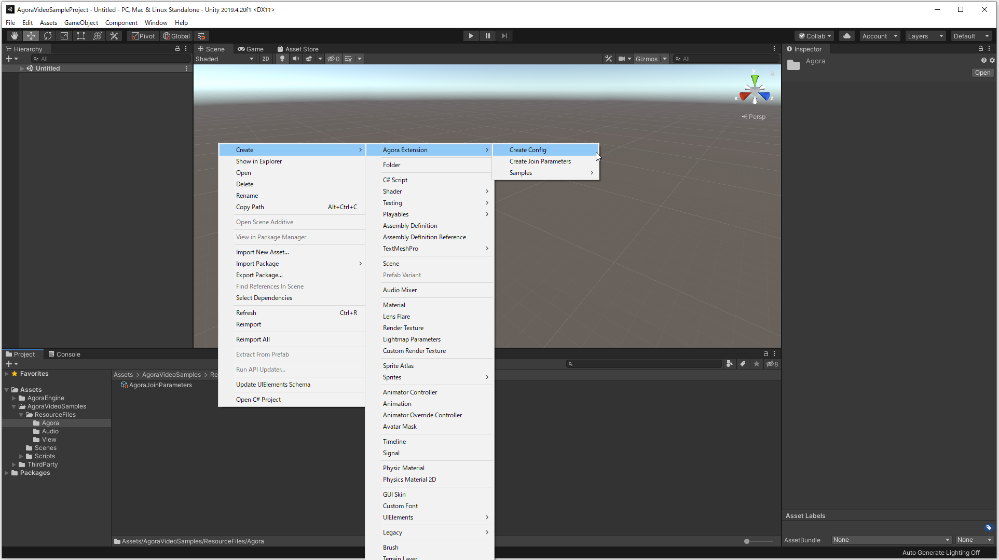
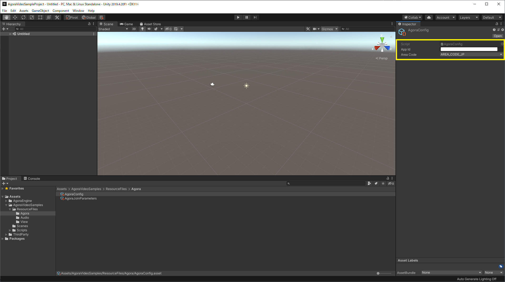
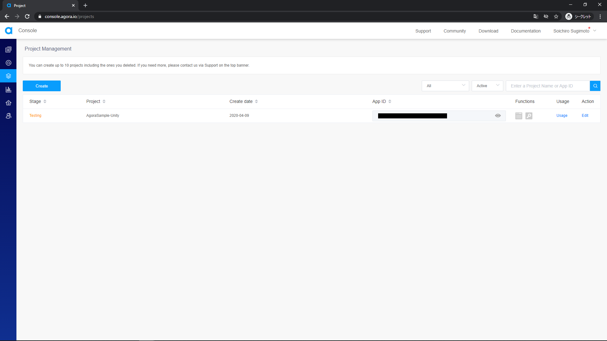
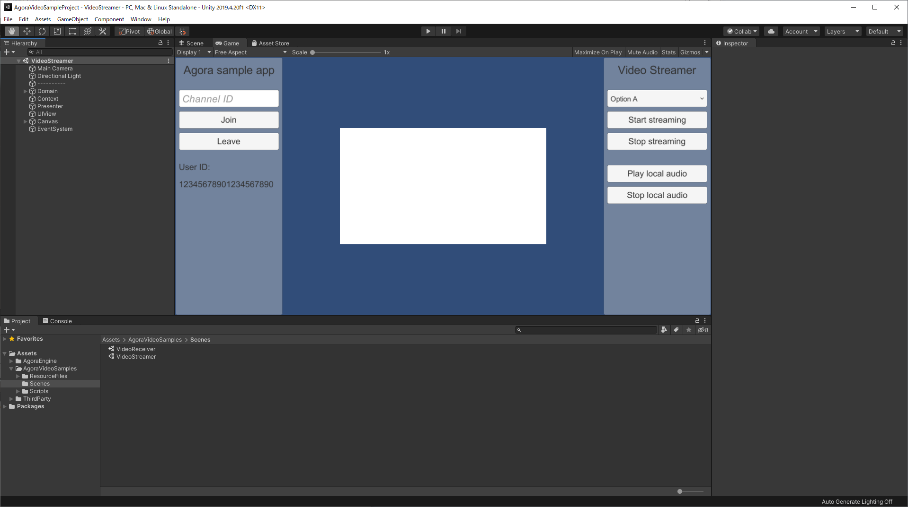
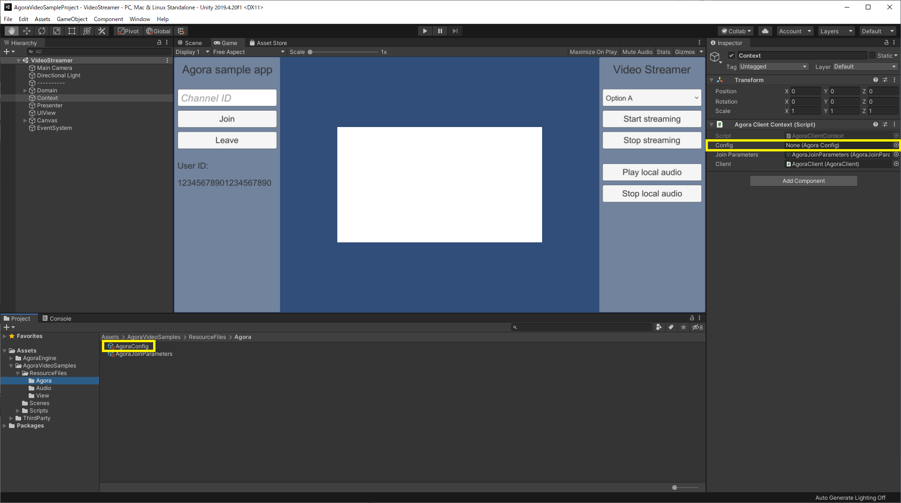
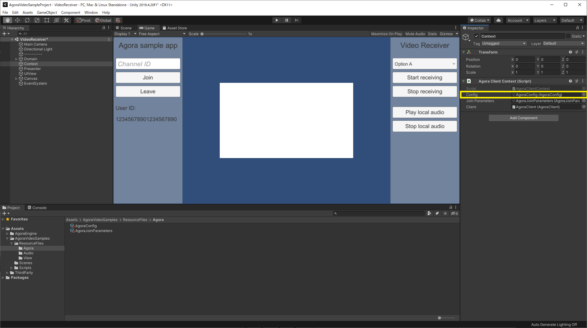

# Sample scenes setup

## 1.
- "Create -> Agora Extension -> Create Config"からコンフィグファイルを作成する
- App IDをセットする

## 2.
- "Assets/AgoraVideoSamples/Scenes"にある"VideoStreamer"のシーンを開く
- Contextオブジェクトの"AgoraClientContext"にコンフィグをセットする

## 3.
- "Assets/AgoraVideoSamples/Scenes"にある"VideoReceiver"のシーンを開く
- Contextオブジェクトの"AgoraClientContext"にコンフィグをセットする

